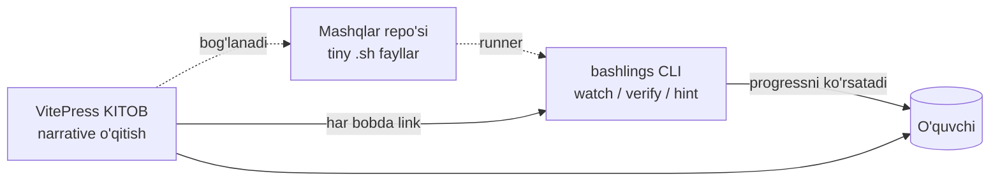
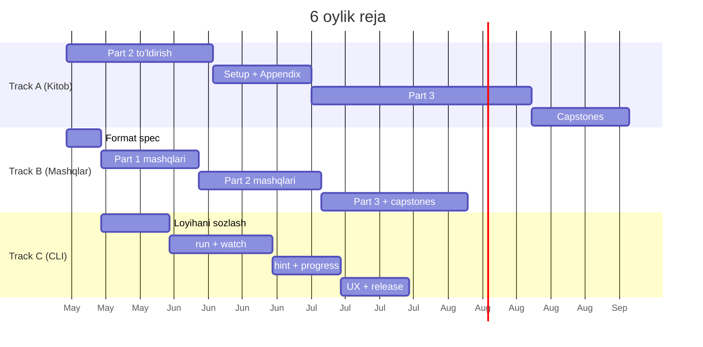

# Hujjatlar holati va kengaytirish rejasi

> Yaratilgan: **2026-05-16** · Yangilangan: **2026-05-16** (Rust-modeli vizyoni qo'shildi)
> Maqsad: **Rust-book + Rustlings** modelida ishlovchi **uzbek tilidagi to'liq Bash & Linux o'qitish ekotizimi** yaratish.

---

## 0. Loyiha vizyoni

### 0.1. Asosiy g'oya

> Rust dasturchilari **The Rust Book** (kitob) va **Rustlings** (interaktiv CLI mashqlar) ni parallel ishlatib o'rganadi. Biz aynan shu modelni Bash uchun mahalliylashtiramiz.



### 0.2. Uchta tayanch (Three Pillars)

| Pillar               | Mavzu                              | Roli                          | Hozirgi holat       |
|----------------------|------------------------------------|-------------------------------|---------------------|
| **A. KITOB**         | VitePress markdown sahifalar       | "Nima va nima uchun"          | 🟢 ~50% tayyor      |
| **B. MASHQLAR**      | `exercises/*.sh` fayllar           | "Hozir o'zing bajarib ko'r"   | 🔴 0% — boshlanmagan|
| **C. CLI**           | `bashlings` runner (Rust/Go)       | "Avto-tekshirish + UX"        | 🔴 0% — boshlanmagan|

### 0.3. Loyihaning yakuniy ko'rinishi

```
bash-doc/                              ← monorepo (taklif)
├── docs/                              ← Pillar A: KITOB
│   └── (VitePress)
├── exercises/                         ← Pillar B: MASHQLAR
│   ├── 01_intro/
│   │   ├── intro1.sh                  # "# I AM NOT DONE" markerli
│   │   ├── intro1.hint.md
│   │   └── README.md
│   └── ...
├── solutions/                         ← yashirin (CLI tekshiruvi uchun)
├── cli/                               ← Pillar C: bashlings CLI
│   ├── src/
│   ├── Cargo.toml
│   └── info.toml                      # mashqlar meta-ma'lumoti
└── STATUS.md
```

---

## 1. Hozirgi statistika

### 1.1. Yig'ma ko'rsatkichlar

| Ko'rsatkich                   | Qiymat       |
|-------------------------------|--------------|
| Jami markdown fayllar         | **12 ta**    |
| Jami qator (LOC)              | **2289**     |
| Jami so'z                     | **~8 600**   |
| Jami kod bloklar              | **106 ta**   |
| Jami jadval qatorlari         | **148 ta**   |
| Jami `:::` containerlar       | **41 ta**    |
| H2 sarlavhalar                | **84 ta**    |
| H3 sarlavhalar                | **65 ta**    |
| **Mashq (`.sh`) fayllar**     | **0 ta** 🔴  |
| **CLI binary**                | **yo'q** 🔴  |
| **Capstone loyihalar**        | **0 ta** 🔴  |

### 1.2. Fayl-fayl ko'rinishi

| Fayl                                  | Qator | So'z  | Kod bl. | Mashq refs | Holat        |
|---------------------------------------|------:|------:|--------:|-----------:|--------------|
| `index.md`                            |    74 |   320 |       0 |          0 | ✅ Tayyor    |
| `resources.md`                        |    50 |   223 |       0 |          0 | ✅ Tayyor    |
| `part1/01-introduction.md`            |   211 |   809 |      10 |          0 | ✅ To'liq    |
| `part1/02-navigation.md`              |   312 | 1 284 |      21 |          0 | ✅ To'liq    |
| `part1/03-pipes-redirection.md`       |   326 | 1 167 |      23 |          0 | ✅ To'liq    |
| `part1/04-text-processing.md`         |   295 | 1 284 |      21 |          0 | ✅ To'liq    |
| `part1/05-basic-scripting.md`         |   513 | 1 627 |      26 |          0 | ✅ To'liq    |
| `part2/01-functions.md`               |    76 |   242 |       1 |          0 | 🚧 Outline   |
| `part2/02-arrays.md`                  |    77 |   257 |       1 |          0 | 🚧 Outline   |
| `part2/03-sed-awk.md`                 |    82 |   355 |       1 |          0 | 🚧 Outline   |
| `part2/04-traps-signals.md`           |    87 |   316 |       1 |          0 | 🚧 Outline   |
| `part2/05-robust-scripting.md`        |   186 |   698 |       1 |          0 | 🚧 Outline   |

> **Diqqat:** "Mashq refs" ustuni — kitob ichida `bashlings watch X` ga ishora qatorlar soni. Hozir har joyda **0**. Bu — kitobni mashqlar bilan bog'lashda eng katta bo'shliq.

### 1.3. Qism bo'yicha tayyorlik

| Qism                | Pillar A (kitob) | Pillar B (mashq) | Pillar C (CLI) |
|---------------------|------------------|------------------|----------------|
| Part 1              | ✅ ~95%          | 🔴 0%            | 🔴 0%          |
| Part 2              | 🚧 ~10%          | 🔴 0%            | 🔴 0%          |
| Part 3 (kelajak)    | 🔴 0%            | 🔴 0%            | 🔴 0%          |
| Setup / Appendices  | 🔴 0%            | —                | 🔴 0%          |

---

## 2. Rust-modeliga moslashish — yetishmayotgan elementlar

### 2.1. Kitob (book) tomondan yetishmayotgan struktura

| Rust-book elementi                               | Bizda bormi? | Qo'shish kerak                       |
|--------------------------------------------------|--------------|--------------------------------------|
| **Foreword + Introduction** sahifa                | ❌           | `docs/foreword.md`                  |
| **Setup** bobi (CLI o'rnatish)                    | ❌           | `docs/setup.md`                     |
| **Har bob boshida "What you'll learn"**           | ❌           | Har `part1/*.md` boshiga TL;DR      |
| **Capstone mini-loyihalar**                       | ❌           | 3 ta yangi `projects/*.md`          |
| **Kitobdan mashqqa ishora** (`bashlings watch X`) | ❌           | Har bobning mashqlar bo'limida      |
| **Appendix sahifalar (A–E)**                      | ❌           | `docs/appendix/*.md`                |
| **Glossary (atamalar lug'ati)**                   | ❌           | `docs/glossary.md`                  |
| **Concept dependency diagrammasi**                | ❌           | Har Part boshida mermaid            |
| **Index of commands**                             | ⚠️ qisman    | `docs/appendix/a-cheatsheet.md`     |

### 2.2. Pillar B — Mashq infratuzilmasi yo'q

Hozir o'quvchi bobni o'qib, **terminalga o'tishi uchun aniq ko'rsatma yo'q**. Har bobda "Mashqlar" bo'limi bor, lekin:
- Javoblar yo'q
- Tekshirish mexanizmi yo'q
- Bir-biriga bog'liq mashqlar zanjiri yo'q
- O'quvchi "to'g'ri qildimmi" deb tasdiq olmaydi

### 2.3. Pillar C — CLI yo'q

`bashlings` CLI hozircha mavjud emas. Bu — eng ko'p texnik mehnat talab qiluvchi qism.

---

## 3. Mashq (exercise) formati spetsifikatsiyasi

### 3.1. Fayl tuzilishi

Har mashq **2 ta majburiy + 1 ta yashirin** fayldan iborat:

```
exercises/01_intro/
├── intro1.sh              # mashq fayli (o'quvchi tahrirlaydi)
├── intro1.hint.md         # bosqichli maslahat
└── (solutions/01_intro/intro1.sh)   # yashirin — solutions/ ichida
```

### 3.2. `.sh` fayl shabloni

```bash
#!/usr/bin/env bash
#
# MASHQ: <qisqa sarlavha>
# DARAJA: ★☆☆☆☆
# MAVZU: <part1/03-pipes-redirection>
#
# <Ikki-uch qator vazifa tavsifi>
#
# Skript ishga tushganda quyidagi natijani berishi kerak:
#   <expected output>
#
# Tuzating va # I AM NOT DONE qatorini o'chiring.

# I AM NOT DONE

# === SENING KODING SHU YERDA ===

eko "Salom, Bash!"   # <-- xato

# === TEST META (CLI o'qiydi, qo'l urmang) ===
# @test:stdout: Salom, Bash!
# @test:exit: 0
# @test:files: -
```

### 3.3. `info.toml` — markaziy registry

```toml
# cli/info.toml
[[exercises]]
name = "intro1"
path = "exercises/01_intro/intro1.sh"
mode = "compile"          # yoki "test"
hint = "exercises/01_intro/intro1.hint.md"
chapter = "part1/01-introduction"

[[exercises]]
name = "intro2"
path = "exercises/01_intro/intro2.sh"
...
```

### 3.4. Test rejimlari (CLI buni qo'llab-quvvatlashi kerak)

| Rejim              | Tekshiradi                                  | Misol                       |
|--------------------|---------------------------------------------|-----------------------------|
| `stdout`           | Skript stdout berilgan satrga teng          | `echo`/`printf` mashqlari   |
| `exit`             | Exit code teng                              | `if`/`exit` mashqlari       |
| `files`            | Belgilangan fayl yaratildi / o'chirildi     | `touch`/`rm` mashqlari      |
| `shellcheck`       | ShellCheck warning 0                        | Robust scripting mashqlari  |
| `regex`            | stdout regex'ga mos                         | dinamik chiqish             |

---

## 4. CLI (`bashlings`) arxitekturasi

### 4.1. Asosiy buyruqlar

| Buyruq                                  | Vazifasi                                       |
|-----------------------------------------|------------------------------------------------|
| `bashlings list`                        | Barcha mashqlar + status (✅/❌/🔒 locked)     |
| `bashlings run <name>`                  | Bitta mashqni tekshirish                       |
| `bashlings watch`                       | **Asosiy rejim** — saqlashda avto-tekshirish   |
| `bashlings hint <name>`                 | Bosqichma-bosqich maslahat                     |
| `bashlings progress`                    | "27 / 120 (22%)" ko'rinishida hisobot          |
| `bashlings reset <name>`                | Boshlang'ich holatga qaytarish                 |
| `bashlings next`                        | Keyingi tugallanmagan mashqqa o'tish           |

### 4.2. Texnik qaror nuqtalari (TBD)

| # | Savol                       | Variantlar                  | Hozirgi tavsiya     |
|---|-----------------------------|----------------------------|---------------------|
| 1 | CLI tili                    | Rust / Go / Bash           | **Rust** (cargo, rustlings'ga sodiq) |
| 2 | Repo strategiyasi           | Monorepo / 3 ta alohida    | **Monorepo**        |
| 3 | Brend nom                   | bashlings / bash-uz / ...  | **bashlings** (TBD) |
| 4 | Tarqatish                   | cargo / brew / curl-script | **cargo + brew**    |
| 5 | Watch backend               | notify-rs / polling        | **notify-rs**       |
| 6 | TUI                         | plain / ratatui            | MVP: plain, keyin ratatui |

### 4.3. Minimal MVP (Phase 1 doirasi)

MVP'da faqat 4 ta buyruq bo'lishi yetadi:

1. `bashlings list`
2. `bashlings run <name>`
3. `bashlings watch`
4. `bashlings hint <name>`

Qolganlari Phase 2 da.

---

## 5. Capstone mini-loyihalar (Rust-book uslubida)

Har 3-4 ta nazariy bobdan keyin **bitta capstone bob** — o'rganilgan narsalarni real loyihada birlashtirish.

| #  | Loyiha                       | Joylashuvi                | Birlashtirilgan mavzular                                    |
|----|------------------------------|---------------------------|-------------------------------------------------------------|
| 1  | **Backup CLI**               | Part 1 dan keyin          | navigation + redirection + scripting + if/for               |
| 2  | **Mini-grep (`ugrep`)**      | Part 2 dan keyin          | functions + arrays + sed/awk + arg parsing                  |
| 3  | **Server Health Dashboard**  | Part 3 dan keyin (kelajak)| curl + jq + cron + trap + ShellCheck                        |
| 4  | **Dotfiles manager**         | Part 3 dan keyin          | symlinks + env + idempotent skript                          |

Har capstone bobi:
- "Talab" bo'limi (acceptance criteria)
- "Loyihani bosqichma-bosqich qurish" (5-7 commit, har biri kichik qadam)
- "Kengaytirish g'oyalari" (bonus mashq)

---

## 6. Yo'l xaritasi — 3 parallel track

### 6.1. Track A — KITOB kontenti

| Sprint   | Vazifa                                                       | DoD                        | Holat |
|----------|--------------------------------------------------------------|----------------------------|-------|
| A1       | Part 2 ning 5 ta bobini to'la yozish (~3000 qator)           | Har bob ≥500 qator         | ✅ (5/5 — 3673 qator) |
| A2       | Setup, Foreword, Glossary, Appendix A-E sahifalar            | 7 yangi sahifa             | ⏳    |
| A3       | Har Part 1 bobi boshiga "What you'll learn" TL;DR            | 5 bobda yangilanish        | ⏳    |
| A4       | Part 3 (Network, SSH, jq, Cron, Docker, CI/CD) — 6 bob       | ~3500 qator                | ✅ (6/6 to'liq — 4 432 qator) |
| A5       | Capstone bob 1, 2, 3 yozish                                  | 3 yangi sahifa             | ⏳    |

### 6.2. Track B — MASHQLAR

| Sprint   | Vazifa                                                       | DoD                        |
|----------|--------------------------------------------------------------|----------------------------|
| B1       | Exercise format va `info.toml` schema'ni cheklash            | Spec dokument tayyor       | ✅ |
| B2       | Part 1 uchun 25 ta mashq (~5 har bobga)                      | 25 .sh + 25 hint + soluti.  | ✅ (32/25 — Part 1 to'la) |
| B3       | Part 2 uchun 30 ta mashq                                     | 30 .sh + javoblar          | ✅ (28/30 — Part 2 yopildi) |
| B4       | Part 3 uchun 35 ta mashq                                     | 35 .sh + javoblar          | 🚧 (6/35 — jq) |
| B5       | Capstone-grade mashqlar (multi-step)                         | 3 capstone exercise pack   | ⏳ |

### 6.3. Track C — CLI

| Sprint   | Vazifa                                                       | DoD                        | Holat |
|----------|--------------------------------------------------------------|----------------------------|-------|
| C1       | Cargo loyihasini sozlash, `info.toml` parser                 | `bashlings list` ishlaydi  | ✅    |
| C2       | `run` buyrug'i + `stdout`/`stdout-cmd`/`exit` rejimlari      | Mashqni tekshirib bera oladi | ✅    |
| C3       | `watch` rejimi (notify v6 + FSEvents/inotify)                | Fayl saqlanganda auto-tekshiruv + auto-advance | ✅ |
| C4       | `hint` — markdown hint render (zero deps)                    | Hint terminalda chiroyli ko'rinadi | ✅    |
| C5       | UX polish — `next` buyrug'i, SIGPIPE handling                | Beta-ready CLI             | ✅    |
| C6       | `cargo install --path .` + Brew formula + README             | Distribution tayyor        | ✅    |

### 6.4. Bosqichlar (sprint'lar bog'lanishi)



### 6.5. Tavsiya etilgan birinchi 2 hafta (eng yuqori ROI)

1. **Track B1** — Exercise format'ni qat'iy belgilash (bu Track A va C ikkalasiga ham asos)
2. **Track A1 (start)** — Part 2 dan eng oson bob (`01-functions.md`) ni to'la yozish
3. **Track B2 (start)** — Part 1 dagi `01-introduction.md` uchun 5 ta mashq yozish
4. **Track C1 (start)** — Rust loyihasini boshlash, `info.toml` parser yozish

Bu 4 ta vazifani parallel olib borish — har 3 pillar'da aniq tasaviniyat olishimizga olib keladi.

---

## 7. Sifatni yaxshilash (texnik takliflar)

### 7.1. UI / UX (kitob)

- [ ] Har bob boshida **TL;DR / "Vaqt: ~15 daqiqa"** quti
- [ ] Har bob mashqlar bo'limida **`bashlings watch <chapter>`** linki
- [ ] Bosh sahifa hero'ga **"3 pillar" diagrammasi**
- [ ] Sidebar'da **progress indicator** (CLI bilan bog'langan, optional)
- [ ] PrintCSS — bobni PDF qilib eksport

### 7.2. CLI UX detallari

- [ ] Yashil/qizil emoji bilan natija (`✓ intro1`, `✗ intro2`)
- [ ] Xato joyini chizib ko'rsatish (line:col, snippet)
- [ ] Hintlar **bosqichli** ochiladi (Hint 1, Hint 2, Solution)
- [ ] `bashlings watch` — TUI'da to'liq progress bari
- [ ] Locale: uzbek (default), ingliz fallback

### 7.3. Infratuzilma

- [ ] **Monorepo** + GitHub Actions: `docs:build`, `cargo test`, `shellcheck exercises/`
- [ ] `solutions/` test pipeline — har solution o'tishini avto-tasdiqlash
- [ ] Release tagging + semver (book, exercises, CLI alohida)
- [ ] **Lighthouse skor 95+**
- [ ] `og-image.png` ijtimoiy ulashish uchun

---

## 8. Risk va e'tibor

| Risk                                              | Mitigatsiya                                   |
|---------------------------------------------------|-----------------------------------------------|
| 3 ta track sinxron emasligi                       | `info.toml` — yagona haqiqat manbai           |
| Mashqlar eskirishi (`grep -P` portativ emas)      | `shellcheck` + matritsali CI (Linux+macOS)    |
| O'quvchi CLI o'rnatishda taqalib qolishi          | `setup.md` ni juda batafsil yozish, 1-buyruqli install script |
| Tarjima atamalar nomuvofiqligi                    | `glossary.md` — yagona standart manba         |
| Capstone'lar haddan tashqari murakkab bo'lishi    | Har bosqichni alohida commit qilib ko'rsatish |
| Brend nomi (`bashlings`) noaniq                   | Karor 4-savolda — birinchi navbatda hal qilish|

---

## 9. Yangilangan maqsadlar (3 va 6 oylik)

| Ko'rsatkich                       | Hozir     | 3 oy maqsad   | 6 oy maqsad     |
|-----------------------------------|-----------|---------------|-----------------|
| Markdown fayllar                  | 12        | 25            | 40+             |
| Jami so'z                         | 8 600     | 22 000        | 45 000          |
| Tugallangan boblar                | 5 / 10    | 15 / 20       | 25 / 25         |
| Capstone loyihalar                | 0         | 1             | 3               |
| Glossary atamalar                 | 0         | 50            | 150             |
| **Mashq fayllari**                | 0         | 30            | 90+             |
| **CLI tugallangan buyruqlar**     | 0         | 4 (MVP)       | 7 (to'liq)      |
| **CLI tarqatish kanali**          | yo'q      | cargo (alpha) | cargo + brew    |
| **Capstone mini-loyihalar**       | 0         | 1             | 3               |
| **GitHub stars (kelajak metrika)**| –         | 50            | 500             |

---

## 10. Tezkor xulosa va birinchi qadam

✅ **Kuchli asos:** Part 1 sifatli yozilgan, VitePress production-grade, uslub bir xil.

🔴 **Eng katta bo'shliq:** Mashq infratuzilmasi (Pillar B) va CLI (Pillar C) butunlay yo'q. Kitob alohida o'zicha **passiv** — Rust modelining sehrini yo'qotadi.

🎯 **Birinchi qadam (sizdan tasdiq talab qiladi):**

1. **4 ta TBD savolga javob bering** (CLI tili, repo, brend, MVP doirasi — §4.2 jadvali).
2. Tasdiqdan keyin men quyidagilarni parallel boshlayman:
   - **Track B1:** `exercises/` katalogi + format spec + birinchi 5 ta mashq (Part 1 / 01-introduction)
   - **Track A1:** Part 2 ning `01-functions.md` ni to'la yozish (~550 qator)
   - **Track C1 (skeleton):** Agar Rust tanlasangiz, `cli/Cargo.toml` + `bashlings list` skelet

🔮 **Yakuniy ko'rinish (6 oydan keyin):**

> Foydalanuvchi `brew install bashlings` qiladi, kitobni o'qiy boshlaydi, har bobdan keyin `bashlings watch` ni ochib qoldiradi va terminalda yashil "✓" larni to'plab borib, oxirida **Backup CLI**, **mini-grep** va **Server Dashboard** loyihalarini o'z qo'li bilan yozadi. Hammasi — uzbek tilida.

Bu — Bash'ni o'rganishni rust-tipidagi **tezkor + qiziqarli** tajribaga aylantiradi.
