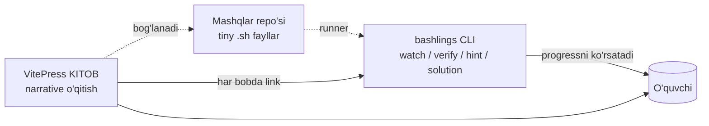

# Loyiha holati va yo'l xaritasi

> Yaratilgan: **2026-05-16** · Yangilangan: **2026-05-26** (Part 3 + CLI overhaul tugadi)
> Maqsad: **Rust-book + Rustlings** modelida ishlovchi **uzbek tilidagi to'liq Bash & Linux o'qitish ekotizimi** yaratish.

---

## 0. Loyiha vizyoni

### 0.1. Asosiy g'oya

> Rust dasturchilari **The Rust Book** (kitob) va **Rustlings** (interaktiv CLI mashqlar) ni parallel ishlatib o'rganadi. Biz aynan shu modelni Bash uchun mahalliylashtiramiz.



### 0.2. Uchta tayanch (Three Pillars)

| Pillar               | Mavzu                              | Roli                          | Hozirgi holat       |
|----------------------|------------------------------------|-------------------------------|---------------------|
| **A. KITOB**         | VitePress markdown sahifalar       | "Nima va nima uchun"          | 🟢 ~95% tayyor      |
| **B. MASHQLAR**      | `exercises/*.sh` fayllar           | "Hozir o'zing bajarib ko'r"   | 🟢 100% (101/101)   |
| **C. CLI**           | `bashlings` runner (Rust)          | "Avto-tekshirish + UX"        | 🟢 100% (8 buyruq)  |

### 0.3. Loyihaning yakuniy ko'rinishi

```
bash-doc/
├── docs/                              ← Pillar A: KITOB
│   ├── index.md / foreword.md / setup.md / glossary.md
│   ├── part1/ ... part3/              # 16 bob
│   └── .vitepress/config.ts
├── exercises/                         ← Pillar B: MASHQLAR
│   ├── info.toml                      # 101 ta yozuv
│   ├── 01_intro/ ... 16_cicd/         # 16 bo'lim, 101 ta .sh + hint + README
├── .solutions/                        ← YASHIRIN — CLI orqali ochiladi
├── cli/                               ← Pillar C: bashlings CLI
│   ├── src/                           # main.rs, info.rs, test.rs, commands/
│   ├── Cargo.toml
│   └── Formula/bashlings.rb           # Homebrew (lokal)
└── STATUS.md                          # bu fayl
```

---

## 1. Hozirgi statistika

### 1.1. Yig'ma ko'rsatkichlar

| Ko'rsatkich                   | Qiymat       |
|-------------------------------|--------------|
| Markdown fayllar (kitob)      | **19 ta**    |
| Jami kitob qatorlari          | **~8 500+**  |
| Boblar (3 qism)               | **16 ta**    |
| **Mashq (`.sh`) fayllar**     | **101 ta** 🟢 |
| **Hint fayllar**              | **101 ta** 🟢 |
| **Yechim fayllar**            | **101 ta** 🟢 |
| **CLI binary**                | **0.8 MB** 🟢 |
| **CLI buyruqlari**            | **8 ta** 🟢   |
| **Capstone loyihalar**        | **0 ta** 🔴  |

### 1.2. Qism bo'yicha mashqlar

| Qism    | Boblar | Mashqlar | Holat |
|---------|--------|----------|-------|
| Part 1  | 5      | 32       | 🟢 100% |
| Part 2  | 5      | 28       | 🟢 100% |
| Part 3  | 6      | 41       | 🟢 100% |
| **JAMI** | **16** | **101**  | 🟢      |

### 1.3. Pillar A — Kitob detali

| Sahifa                              | Holat                    |
|-------------------------------------|--------------------------|
| `index.md` (bosh)                   | 🟢 Tayyor                |
| `foreword.md` (kirish so'zi)         | 🟢 Tayyor                |
| `setup.md` (o'rnatish)              | 🟢 Tayyor                |
| `glossary.md` (~50 atama)           | 🟢 Tayyor                |
| `resources.md` (manbalar)           | 🟢 Tayyor                |
| Part 1: 5 bob                       | 🟢 To'liq + bashlings link |
| Part 2: 5 bob                       | 🟢 To'liq + bashlings link |
| Part 3: 6 bob (net/ssh/jq/cron/docker/cicd) | 🟢 To'liq + bashlings link |
| Part 1 boblari top "Vaqt+Mashqlar" callout | 🔴 Yo'q (Part 2+3 da bor) |
| Appendix A–E                        | 🔴 Yo'q                 |
| Capstone loyiha boblari (3 ta)      | 🔴 Yo'q                 |
| Concept-dependency mermaid har Part'da | 🔴 Yo'q              |

---

## 2. CLI — joriy holat

### 2.1. Buyruqlar (10/10 tayyor)

| Buyruq                       | Vazifasi                                              | Holat |
|------------------------------|-------------------------------------------------------|-------|
| `bashlings list`             | Hamma mashqlar + status (`--pending/--done/--json`)   | 🟢    |
| `bashlings run [name]`       | Mashqni tekshirish (nomsiz — keyingi pending)          | 🟢    |
| `bashlings verify`           | Hammasini tartibda, birinchi xatoda to'xtash          | 🟢    |
| `bashlings watch`            | Interaktiv rejim — fayl saqlash + hotkeys             | 🟢    |
| `bashlings hint <name>`      | Progressiv maslahat (`--all/--reset`)                  | 🟢    |
| `bashlings solution <name>`  | Yechim — **faqat test pass'dan keyin**                | 🟢    |
| `bashlings reset <name>`     | Asl holatga qaytarish (git checkout — kod + marker)    | 🟢    |
| `bashlings progress`         | Compact statistika (`--json` ham)                      | 🟢    |
| `bashlings next`             | Birinchi pending mashq nomi (`--json` ham)             | 🟢    |
| `bashlings completions <sh>` | Shell completion (bash/zsh/fish/...)                   | 🟢    |

### 2.2. Watch rejimi hotkeys

| Tugma                  | Harakat                              |
|------------------------|--------------------------------------|
| `h`                    | Maslahat ko'rsatish                  |
| `s`                    | Yechim (test pass'dan keyin ochiladi) |
| `r` / `Enter`          | Joriy mashqni qayta tekshirish        |
| `l` / `p`              | Progress overview                    |
| `q` / `Esc` / `Ctrl+C` | Chiqish                              |

### 2.3. Test framework rejimlari

| Rejim         | Holat | Izoh                                            |
|---------------|-------|-------------------------------------------------|
| `stdout`           | 🟢    | Literal matn taqqoslash                     |
| `stdout-cmd`       | 🟢    | `bash -c` natijasi bilan taqqoslash         |
| `stdout-contains`  | 🟢    | Kichik satr mavjudligini tekshirish         |
| `stdout-regex`     | 🟢    | Regular expression mosligi                  |
| `stderr`           | 🟢    | stderr literal taqqoslash                   |
| `exit`             | 🟢    | Exit code taqqoslash                        |
| `file-exists`      | 🟢    | Fayl/katalog mavjudligini tekshirish        |
| `shellcheck`       | 🔴    | Hali runner'da yo'q (CI'da alohida bor)     |

**Runner mustahkamligi:** har skript 10s timeout bilan (cheksiz tsikl CLI'ni
osmaydi), `stdin=/dev/null` (`read` bloklanmaydi), workspace root cwd'da
(deterministik). `watch` raw-mode RAII guard bilan (xato bo'lsa ham terminal
tiklanadi). bash 4'dan past versiyada ogohlantirish chiqadi.

### 2.4. Distribution

| Kanal           | Holat                                       |
|-----------------|---------------------------------------------|
| `cargo install --path .` (lokal) | 🟢 Ishlaydi                |
| GitHub Releases (tayyor binarylar) | 🟡 Workflow tayyor (`release.yml`) — `v*` tag push kerak |
| Bir qatorli install skript        | 🟢 `scripts/install.sh` (Releases'ga tayanadi) |
| `cargo install bashlings` (crates.io) | 🟡 Paket tayyor (`--dry-run` ✓) + CI step — token kerak |
| Homebrew formula (binar)          | 🟢 `cli/Formula/bashlings.rb` + `scripts/update-formula.sh` |
| Homebrew tap (jonli) | 🟡 Formula tayyor — `homebrew-bashlings` repo kerak |

**Release oqimi:** `v0.1.0` tag push → `release.yml` 5 platforma uchun binar +
sha256 yuklaydi → install skript va Homebrew formula shularni iste'mol qiladi.
crates.io publish `CARGO_REGISTRY_TOKEN` secret bo'lsa avtomatik.

**Qolgan qo'lda qadamlar (tashqi hisob/token kerak):**
1. `git tag v0.1.0 && git push origin v0.1.0` — Releases'ni ishga tushiradi
2. crates.io: token → `CARGO_REGISTRY_TOKEN` secret (yoki `cargo publish`)
3. Homebrew: `homebrew-bashlings` repo yaratish → `scripts/update-formula.sh v0.1.0` → formulani commit

---

## 3. Sifat infratuzilmasi

| Element                                | Holat       |
|----------------------------------------|-------------|
| `cargo build --release`                | 🟢 0 warning |
| `cargo test`                           | 🟢 50 ta test (42 unit + 8 integratsion `tests/cli.rs`) |
| Solutions test pipeline (har solution o'tishini tasdiqlash) | 🟢 `scripts/test-solutions.sh` (101/101) |
| `shellcheck exercises/`                | 🟢 CI'da (exercises info-only, .solutions strict) |
| `docs:build` (VitePress)               | 🟢 Lokalda + CI'da ishlaydi |
| **GitHub Actions CI**                  | 🟢 `.github/workflows/ci.yml` (cli + solutions + shellcheck + docs) |
| `CONTRIBUTING.md`                      | 🟢 Mavjud   |
| `CHANGELOG.md`                         | 🟢 Mavjud   |
| `LICENSE` fayl                         | 🟢 Mavjud (MIT) |

---

## 4. Yo'l xaritasi — keyingi 3-6 oy

### 4.1. Track A — Kitob qolgan ishlari

| Sprint | Vazifa | DoD | Tahminiy ish |
|--------|--------|-----|--------------|
| A1     | Part 1 boblariga top callout (Vaqt + What you'll learn) | 5 bob yangilangan | 30 daqiqa |
| A2     | Appendix A: Cheatsheet (eng ko'p ishlatiladigan buyruqlar) | 1 sahifa, ~200 qator | 2 soat |
| A3     | Appendix B: ShellCheck rules | 1 sahifa | 1 soat |
| A4     | Capstone 1: **Backup CLI** | 1 bob + 1 exercise pack | 6 soat |
| A5     | Capstone 2: **mini-grep (`ugrep`)** | 1 bob | 6 soat |
| A6     | Capstone 3: **Server Health Dashboard** | 1 bob | 8 soat |

### 4.2. Track B — Mashqlar qolgan ishlari

| Sprint | Vazifa | DoD |
|--------|--------|-----|
| B1     | Capstone-grade multi-step mashqlar (3 pack) | 3 capstone exercise pack |
| B2     | Test framework kengaytirish: `stderr`, `regex`, `file`, `shellcheck` rejimlari | runner'da to'liq qo'llab-quvvatlash |

### 4.3. Track C — CLI / Infrastructure

| Sprint | Vazifa | DoD |
|--------|--------|-----|
| C1     | `cargo test` — info.rs unit testlari (`strip_done_marker`, `restore_done_marker`, `has_marker_line`) | ≥10 ta test |
| C2     | **GitHub Actions CI** — `cargo build`, `docs:build`, solutions test, shellcheck | `.github/workflows/ci.yml` |
| C3     | Crates.io'ga publish | `cargo publish` muvaffaqiyatli |
| C4     | Homebrew tap (`homebrew-bashlings` repo) | `brew install qobulovasror/bashlings/bashlings` ishlaydi |
| C5     | Bir buyruqli install script (`curl ... \| sh`) | macOS+Linux'da ishlaydi |
| C6     | `CONTRIBUTING.md` + `LICENSE` + `CHANGELOG.md` | Standart OSS fayllar |

---

## 5. Tezkor xulosa

### Bajarilgani

✅ **3 ustun ishlamoqda:** kitob (95%), mashqlar (100%), CLI (100% MVP).
✅ **Rustlings parity:** auto-marker-removal, gated solution reveal, interaktiv watch hotkeys.
✅ **101 mashq + 101 hint + 101 yechim** — har birining yechimi avtomatik tekshirilgan.

### Eng katta qolgan bo'shliqlar (ROI tartibida)

1. 🟢 **GitHub Actions CI** — bajarildi (`.github/workflows/ci.yml`)
2. 🟢 **Cargo unit testlar** — bajarildi (31 ta test)
3. 🔴 **Part 1 top callouts** — uchlik bashlash nuqtasini birinchi taasurot uchun
4. 🔴 **1 ta Capstone bob** — kursni "tugatilgan" his qildiradi
5. 🔴 **Distribution** — Crates.io / Homebrew tap

### Yakuniy ko'rinish (Q3 2026)

> Foydalanuvchi `brew install bashlings` qiladi → `bashlings.uz` ga o'tib kitobni o'qiy boshlaydi → har bobdan keyin `bashlings watch` ni ochib qoldiradi → terminalda 101 ta yashil ✓ to'plab borib, oxirida **Backup CLI**, **mini-grep** va **Server Dashboard** capstone loyihalarini o'z qo'li bilan yozadi.
