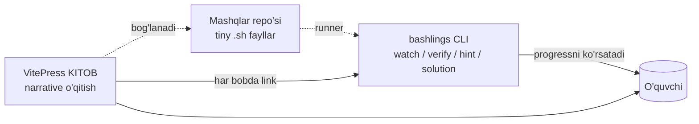

# Loyiha holati va yo'l xaritasi

> Yaratilgan: **2026-05-16** · Yangilangan: **2026-05-26** (Part 3 + CLI overhaul tugadi)
> Maqsad: **Rust-book + Rustlings** modelida ishlovchi **uzbek tilidagi to'liq Bash & Linux o'qitish ekotizimi** yaratish.

---

## 0. Loyiha vizyoni

### 0.1. Asosiy g'oya

> Rust dasturchilari **The Rust Book** (kitob) va **Rustlings** (interaktiv CLI mashqlar) ni parallel ishlatib o'rganadi. Biz aynan shu modelni Bash uchun mahalliylashtiramiz.



### 0.2. Uchta tayanch (Three Pillars)

| Pillar               | Mavzu                              | Roli                          | Hozirgi holat       |
|----------------------|------------------------------------|-------------------------------|---------------------|
| **A. KITOB**         | VitePress markdown sahifalar       | "Nima va nima uchun"          | 🟢 ~95% tayyor      |
| **B. MASHQLAR**      | `exercises/*.sh` fayllar           | "Hozir o'zing bajarib ko'r"   | 🟢 100% (101/101)   |
| **C. CLI**           | `bashlings` runner (Rust)          | "Avto-tekshirish + UX"        | 🟢 100% (8 buyruq)  |

### 0.3. Loyihaning yakuniy ko'rinishi

```
bash-doc/
├── docs/                              ← Pillar A: KITOB
│   ├── index.md / foreword.md / setup.md / glossary.md
│   ├── part1/ ... part3/              # 16 bob
│   └── .vitepress/config.ts
├── exercises/                         ← Pillar B: MASHQLAR
│   ├── info.toml                      # 101 ta yozuv
│   ├── 01_intro/ ... 16_cicd/         # 16 bo'lim, 101 ta .sh + hint + README
├── .solutions/                        ← YASHIRIN — CLI orqali ochiladi
├── cli/                               ← Pillar C: bashlings CLI
│   ├── src/                           # main.rs, info.rs, test.rs, commands/
│   ├── Cargo.toml
│   └── Formula/bashlings.rb           # Homebrew (lokal)
└── STATUS.md                          # bu fayl
```

---

## 1. Hozirgi statistika

### 1.1. Yig'ma ko'rsatkichlar

| Ko'rsatkich                   | Qiymat       |
|-------------------------------|--------------|
| Markdown fayllar (kitob)      | **19 ta**    |
| Jami kitob qatorlari          | **~8 500+**  |
| Boblar (3 qism)               | **16 ta**    |
| **Mashq (`.sh`) fayllar**     | **101 ta** 🟢 |
| **Hint fayllar**              | **101 ta** 🟢 |
| **Yechim fayllar**            | **101 ta** 🟢 |
| **CLI binary**                | **0.8 MB** 🟢 |
| **CLI buyruqlari**            | **8 ta** 🟢   |
| **Capstone loyihalar**        | **0 ta** 🔴  |

### 1.2. Qism bo'yicha mashqlar

| Qism    | Boblar | Mashqlar | Holat |
|---------|--------|----------|-------|
| Part 1  | 5      | 32       | 🟢 100% |
| Part 2  | 5      | 28       | 🟢 100% |
| Part 3  | 6      | 41       | 🟢 100% |
| **JAMI** | **16** | **101**  | 🟢      |

### 1.3. Pillar A — Kitob detali

| Sahifa                              | Holat                    |
|-------------------------------------|--------------------------|
| `index.md` (bosh)                   | 🟢 Tayyor                |
| `foreword.md` (kirish so'zi)         | 🟢 Tayyor                |
| `setup.md` (o'rnatish)              | 🟢 Tayyor                |
| `glossary.md` (~50 atama)           | 🟢 Tayyor                |
| `resources.md` (manbalar)           | 🟢 Tayyor                |
| Part 1: 5 bob                       | 🟢 To'liq + bashlings link |
| Part 2: 5 bob                       | 🟢 To'liq + bashlings link |
| Part 3: 6 bob (net/ssh/jq/cron/docker/cicd) | 🟢 To'liq + bashlings link |
| Part 1 boblari top "Vaqt+Mashqlar" callout | 🔴 Yo'q (Part 2+3 da bor) |
| Appendix A–E                        | 🔴 Yo'q                 |
| Capstone loyiha boblari (3 ta)      | 🔴 Yo'q                 |
| Concept-dependency mermaid har Part'da | 🔴 Yo'q              |

---

## 2. CLI — joriy holat

### 2.1. Buyruqlar (8/8 tayyor)

| Buyruq                       | Vazifasi                                              | Holat |
|------------------------------|-------------------------------------------------------|-------|
| `bashlings list`             | Hamma mashqlar + status (progress bilan)              | 🟢    |
| `bashlings list --pending`   | Faqat tugatilmaganlari                                 | 🟢    |
| `bashlings list --done`      | Faqat tugatilganlari                                   | 🟢    |
| `bashlings run <name>`       | Bitta mashqni tekshirish + pass'da marker avto-o'chadi | 🟢    |
| `bashlings watch`            | Interaktiv rejim — fayl saqlash + hotkeys             | 🟢    |
| `bashlings hint <name>`      | 3-bosqichli maslahat (yechim YO'Q)                     | 🟢    |
| `bashlings solution <name>`  | Yechim — **faqat test pass'dan keyin**                | 🟢    |
| `bashlings reset <name>`     | Marker'ni qaytarish (boshlang'ich holatga)             | 🟢    |
| `bashlings progress`         | Compact statistika                                    | 🟢    |
| `bashlings next`             | Birinchi pending mashq nomi (CI uchun)                 | 🟢    |

### 2.2. Watch rejimi hotkeys

| Tugma                  | Harakat                              |
|------------------------|--------------------------------------|
| `h`                    | Maslahat ko'rsatish                  |
| `s`                    | Yechim (test pass'dan keyin ochiladi) |
| `r` / `Enter`          | Joriy mashqni qayta tekshirish        |
| `l` / `p`              | Progress overview                    |
| `q` / `Esc` / `Ctrl+C` | Chiqish                              |

### 2.3. Test framework rejimlari

| Rejim         | Holat | Izoh                                            |
|---------------|-------|-------------------------------------------------|
| `stdout`      | 🟢    | Literal matn taqqoslash                          |
| `stdout-cmd`  | 🟢    | `bash -c` natijasi bilan taqqoslash              |
| `exit`        | 🟢    | Exit code taqqoslash                             |
| `stderr`      | 🔴    | info.toml'da yo'q, runner'da yo'q                 |
| `regex`       | 🔴    | info.toml'da belgilash mumkin, runner ignore qiladi |
| `file`        | 🔴    | xuddi shunday                                    |
| `shellcheck`  | 🔴    | xuddi shunday                                    |

### 2.4. Distribution

| Kanal           | Holat                                       |
|-----------------|---------------------------------------------|
| `cargo install --path .` (lokal) | 🟢 Ishlaydi                |
| `cargo install bashlings` (crates.io) | 🔴 Yet publish'lanmagan |
| Homebrew formula (lokal)          | 🟢 `cli/Formula/bashlings.rb` |
| Homebrew tap (jonli) | 🔴 Tap repo yo'q                       |
| Bir buyruqli install script        | 🔴 Yo'q                   |

---

## 3. Sifat infratuzilmasi

| Element                                | Holat       |
|----------------------------------------|-------------|
| `cargo build --release`                | 🟢 0 warning |
| `cargo test`                           | 🔴 Hech qaysi unit test yo'q |
| Solutions test pipeline (har solution o'tishini tasdiqlash) | 🔴 Yo'q |
| `shellcheck exercises/`                | 🔴 Yo'q (manual)|
| `docs:build` (VitePress)               | 🟢 Lokalda ishlaydi |
| **GitHub Actions CI**                  | 🔴 `.github/` katalogi mavjud emas |
| `CONTRIBUTING.md`                      | 🔴 Yo'q     |
| `CHANGELOG.md`                         | 🔴 Yo'q     |
| `LICENSE` fayl                         | 🔴 Yo'q (README'da MIT deyilgan, fayl yo'q) |

---

## 4. Yo'l xaritasi — keyingi 3-6 oy

### 4.1. Track A — Kitob qolgan ishlari

| Sprint | Vazifa | DoD | Tahminiy ish |
|--------|--------|-----|--------------|
| A1     | Part 1 boblariga top callout (Vaqt + What you'll learn) | 5 bob yangilangan | 30 daqiqa |
| A2     | Appendix A: Cheatsheet (eng ko'p ishlatiladigan buyruqlar) | 1 sahifa, ~200 qator | 2 soat |
| A3     | Appendix B: ShellCheck rules | 1 sahifa | 1 soat |
| A4     | Capstone 1: **Backup CLI** | 1 bob + 1 exercise pack | 6 soat |
| A5     | Capstone 2: **mini-grep (`ugrep`)** | 1 bob | 6 soat |
| A6     | Capstone 3: **Server Health Dashboard** | 1 bob | 8 soat |

### 4.2. Track B — Mashqlar qolgan ishlari

| Sprint | Vazifa | DoD |
|--------|--------|-----|
| B1     | Capstone-grade multi-step mashqlar (3 pack) | 3 capstone exercise pack |
| B2     | Test framework kengaytirish: `stderr`, `regex`, `file`, `shellcheck` rejimlari | runner'da to'liq qo'llab-quvvatlash |

### 4.3. Track C — CLI / Infrastructure

| Sprint | Vazifa | DoD |
|--------|--------|-----|
| C1     | `cargo test` — info.rs unit testlari (`strip_done_marker`, `restore_done_marker`, `has_marker_line`) | ≥10 ta test |
| C2     | **GitHub Actions CI** — `cargo build`, `docs:build`, solutions test, shellcheck | `.github/workflows/ci.yml` |
| C3     | Crates.io'ga publish | `cargo publish` muvaffaqiyatli |
| C4     | Homebrew tap (`homebrew-bashlings` repo) | `brew install qobulovasror/bashlings/bashlings` ishlaydi |
| C5     | Bir buyruqli install script (`curl ... \| sh`) | macOS+Linux'da ishlaydi |
| C6     | `CONTRIBUTING.md` + `LICENSE` + `CHANGELOG.md` | Standart OSS fayllar |

---

## 5. Tezkor xulosa

### Bajarilgani

✅ **3 ustun ishlamoqda:** kitob (95%), mashqlar (100%), CLI (100% MVP).
✅ **Rustlings parity:** auto-marker-removal, gated solution reveal, interaktiv watch hotkeys.
✅ **101 mashq + 101 hint + 101 yechim** — har birining yechimi avtomatik tekshirilgan.

### Eng katta qolgan bo'shliqlar (ROI tartibida)

1. 🔴 **GitHub Actions CI** — regression himoyasi yo'q
2. 🔴 **Cargo unit testlar** — marker logic uchun
3. 🔴 **Part 1 top callouts** — uchlik bashlash nuqtasini birinchi taasurot uchun
4. 🔴 **1 ta Capstone bob** — kursni "tugatilgan" his qildiradi
5. 🔴 **Distribution** — Crates.io / Homebrew tap

### Yakuniy ko'rinish (Q3 2026)

> Foydalanuvchi `brew install bashlings` qiladi → `bashlings.uz` ga o'tib kitobni o'qiy boshlaydi → har bobdan keyin `bashlings watch` ni ochib qoldiradi → terminalda 101 ta yashil ✓ to'plab borib, oxirida **Backup CLI**, **mini-grep** va **Server Dashboard** capstone loyihalarini o'z qo'li bilan yozadi.
