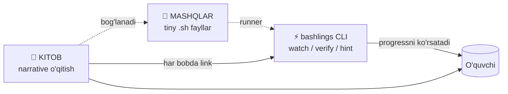

# Foreword

Hello! You have just opened the first complete **Bash & Linux** learning ecosystem in Uzbek.

This is not an ordinary tutorial. It is a three-pillar learning system based on the **The Rust Book + Rustlings** model.

---

## The three pillars



| Pillar          | Technology                | Role                              |
|-----------------|---------------------------|-----------------------------------|
| 📘 **Book**     | VitePress markdown        | "What and why" — theory           |
| 🧪 **Exercises**| `# I AM NOT DONE` .sh     | "Now try it yourself"             |
| ⚡ **CLI**       | `bashlings` (Rust)        | "Auto-check + UX"                 |

This very trio turns **passive reading** into **active skill**.

---

## Who is it for?

::: tip You'll get the most out of this tutorial if:
- You are a **beginner** — just getting acquainted with Linux or Bash
- You are a **junior developer** — entering the DevOps path
- You are a **Backend / SRE** engineer — you want to feel at ease in the terminal
- You love **rich translations** — you know how scarce technical content in Uzbek is
:::

::: warning This book is **not** for you if:
- You only want to read passively and don't intend to open a terminal
- You're looking for Bash's lowest-level POSIX nuances (here the focus is on **practical** Bash 4+)
:::

---

## How to read it?

### 1. Install the CLI first

```bash
# Clone it
git clone https://github.com/qobulovasror/bashlings
cd bashlings/cli

# Build it
cargo install --path .
```

Details → [Setup](/en/setup)

### 2. Read each chapter in 3 stages

1. **Read the book** (15-40 minutes) — understand the theory
2. **Open `bashlings watch`** — collect green ✓ marks in the terminal
3. **Try the extra tasks at the end of the section** by hand in the terminal

::: info The "I AM NOT DONE" concept
Every exercise starts with the `# I AM NOT DONE` marker. Finished the exercise? —
delete that line. The CLI uses it as a progress indicator.
:::

### 3. Chapters in order (or adapt to yourself)

| Part | Topic | Exercises | Recommendation |
|---|---|---|---|
| **Part 1** | Linux & Bash fundamentals | 32 | Read in order |
| **Part 2** | Advanced scripting | 28 | After Part 1 |
| **Part 3** | Real-world (network, ssh, jq, cron, docker, ci) | 41 | Choose by topic |

**Total:** 16 chapters + 101 exercises.

---

## Philosophy

> "We turn learning Bash into a rust-style **fast + fun** experience."

### What sets us apart from others?

- **Auto-checking** — every exercise is verified by stdout/exit code
- **Staged hints** — no "give me the solution"; concept → example → solution
- **Offline-friendly** — everything works without the internet, without a daemon
- **In Uzbek** — the glossary ensures consistency of terms (→ [Glossary](/en/glossary))

### Inspiration

- [The Rust Book](https://doc.rust-lang.org/book/) — its structure
- [`rustlings`](https://github.com/rust-lang/rustlings) — the `# I AM NOT DONE` idea
- [`jlevy/the-art-of-command-line`](https://github.com/jlevy/the-art-of-command-line) — best practices
- [`denysdovhan/bash-handbook`](https://github.com/denysdovhan/bash-handbook) — plain language

---

## In short

1. **Get started:** [Setup →](/en/setup)
2. **Read:** [Chapter 1 — What are the Shell, Terminal, and Bash? →](/en/part1/01-introduction)
3. **Terms:** [Glossary →](/en/glossary)
4. **Need help?** [GitHub Issues](https://github.com/qobulovasror/bashlings/issues)

---

> The terminal isn't magic — it's a **skill**. And every skill comes with practice.
> Are you ready to collect green ✓ marks?

[**→ First chapter**](/en/part1/01-introduction)
