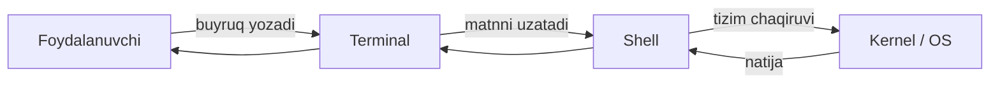

# 1. What are Shell, Terminal and Bash?

> What you will learn in this chapter:
> - The difference between **terminal**, **shell** and **bash** — three separate concepts
> - Opening your first terminal session and entering a command
> - The meaning of the prompt symbol
> - Basic commands: `pwd`, `echo`, `whoami`, `date`
>
> **⏱ Time:** ~15 minutes
> **🧪 Exercises:** `bashlings watch` — 5 interactive exercises ready ([`exercises/01_intro/`](https://github.com/qobulovasror/bashlings/tree/main/exercises/01_intro))

When you start working with Linux or macOS, the first terms you will hear are **terminal**, **shell** and **bash**. Many people think they are the same thing, but in reality these are **three separate concepts**. Let's look at each one in detail.

## 1.1. What is a Terminal?

A **terminal** (or "terminal emulator") is a graphical window of a program that lets you enter text-based commands and see their output.

In other words, the terminal is the **door** (window), and the shell is the **waiter** who comes through that door.

Popular terminal programs:

| OS         | Terminal programs                                      |
|------------|--------------------------------------------------------|
| macOS      | `Terminal.app`, `iTerm2`, `Warp`, `Alacritty`          |
| Linux      | `GNOME Terminal`, `Konsole`, `xterm`, `kitty`          |
| Windows    | `Windows Terminal`, `WSL`, `Git Bash`                  |

::: info Note
The terminal is just a "container". Which shell runs inside it is a separate matter.
:::

## 1.2. What is a Shell?

A **shell** is the **interpreter program** between the user and the operating system kernel. You type `ls`, the shell reads it, sends the kernel a request to "give me the list of files in this folder", and returns the result to you.



The most popular shell programs:

- **`bash`** — Bourne Again SHell (standard on Linux)
- **`zsh`** — Z Shell (default on macOS, very feature-rich)
- **`fish`** — Friendly Interactive Shell (modern, with auto-suggest)
- **`sh`** — POSIX shell (the most minimal)
- **`dash`**, **`ksh`** — other variants

## 1.3. What is Bash?

**Bash** (Bourne Again SHell) is a shell written by Brian Fox in 1989 for the GNU project. It is an extended, enhanced version of the old **`sh`** (Bourne shell).

Today, Bash is:

- The **default** on most Linux distributions
- The **most widely used** for writing scripts
- **Compatible** with the POSIX standard
- **Used** in millions of servers and CI/CD pipelines

::: tip Which shell are you running?
To find out your current shell type:

```bash
echo $SHELL
# /bin/bash  yoki  /bin/zsh
```

Or to see the version:

```bash
bash --version
# GNU bash, version 5.2.15(1)-release ...
```
:::

## 1.4. Prompt — the command line symbol

When you open the terminal, a certain symbol is waiting for you:

```text
user@hostname:~$
```

This is the **prompt**. Its parts:

| Part         | Meaning                                    |
|--------------|--------------------------------------------|
| `user`       | The username                               |
| `hostname`   | The computer name                          |
| `~`          | The current directory (~ — the home directory) |
| `$`          | A regular user (`#` if root)               |

::: warning Caution
If you see `#` in the prompt, you are working as **root** (superuser). Every command must be entered very carefully!
:::

## 1.5. Your first commands

Let's get acquainted with the basic commands:

```bash
# Hello, world
echo "Salom, Bash!"

# Current date and time
date

# Information about the system
uname -a

# Which user are you?
whoami

# Which folder are you in?
pwd

# Where does an existing command run from?
which ls
```

Sample output:

```text
$ whoami
mac
$ pwd
/Users/mac
$ which ls
/bin/ls
```

## 1.6. `man` — your helper

Every Unix command has its own manual. You open it with the `man` (manual) command:

```bash
man ls
man grep
man bash
```

Inside the manual:

- **Up / Down:** `↑ ↓` or `j` `k`
- **Search:** `/word-to-search`, then `Enter`
- **Quit:** `q`

::: tip A faster option
Some commands support the `--help` flag:

```bash
ls --help
grep --help
```
:::

## 1.7. Command history and auto-complete

Bash gives you two enormous features that speed up your work:

### History

```bash
history          # list of recent commands
!!               # re-runs the last command
!123             # runs command number 123 from the history
Ctrl + R         # search the history (incremental search)
```

### Tab completion

You don't have to type the full command or file name — press the `Tab` key and Bash will complete it for you.

```bash
cd Doc<Tab>      # → cd Documents/
ls -l README<Tab> # → ls -l README.md
```

## 1.8. Common mistakes

::: danger A warning for beginners

1. **Pay attention to spaces.** In Bash `x=5` is correct, but `x = 5` is wrong (the space makes them separate arguments).
2. **Never run `rm -rf /`.** This will erase the entire system.
3. **Use `sudo` thoughtfully.** It means "I know what I'm doing".
4. **Commands are case-sensitive.** `ls` and `LS` are not the same.
:::

## 1.9. Exercises

::: tip 🧪 Bashlings — interactive exercises
This chapter's **5** exercises come with auto-checking via the `bashlings` CLI:

```bash
bashlings watch              # start from the first pending exercise
bashlings run intro1         # check a single exercise
bashlings hint intro1        # step-by-step hint
```

Source: [`exercises/01_intro/`](https://github.com/qobulovasror/bashlings/tree/main/exercises/01_intro)
:::

Do the following additional tasks by hand in the terminal:

1. Print the full path of your home directory.
2. Determine which shell you are using.
3. View the `bash` version.
4. Open the `man` page of the `date` command and find and apply the `--iso-8601` flag.
5. Print the last 5 commands from the history (`history | tail -5`).

## 1.10. Summary

| Term        | Essence                                              |
|-------------|------------------------------------------------------|
| **Terminal**| A window with a text interface (a program)           |
| **Shell**   | An interpreter that understands commands (bash, zsh, fish) |
| **Bash**    | The most popular shell program                       |
| **Prompt**  | The command input line (`$` or `#`)                  |
| **`man`**   | The command manual                                  |

In the next chapter we will learn **navigating the file system**: `cd`, `ls`, `pwd`, `mkdir`, `cp`, `mv`, `rm`.

> **Next page:** [2. Navigating the file system →](./02-navigation)
