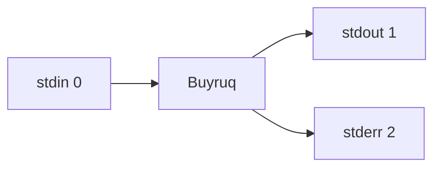

# 3. I/O Redirection and Pipelines

> What you will learn in this chapter:
> - **stdin / stdout / stderr** — the three standard streams
> - **`>` and `>>`** — redirecting output to a file (overwrite vs append)
> - **`<` and `<<`** — reading from a file, heredoc
> - **`|`** (pipe) — chaining commands together
> - **`tee`** — write to a file and the screen at the same time
> - `2>&1` and `/dev/null` — the classic pattern of Unix daemons
>
> **⏱ Time:** ~30 minutes
> **🧪 Exercises:** `bashlings watch` — 8 interactive exercises ready ([`exercises/03_pipes/`](https://github.com/qobulovasror/bashlings/tree/main/exercises/03_pipes))

The most powerful idea in the Unix philosophy:

> "Write small programs that do one job well, and **connect** them with one another to solve complex tasks."

It is precisely **redirection** and **pipes** that bring this idea to life.

## 3.1. The three standard streams

Every Unix process has **3 standard streams**:

| Stream     | Number | Meaning                                |
|------------|--------|----------------------------------------|
| `stdin`    | `0`    | Input (from the keyboard or a file)    |
| `stdout`   | `1`    | Output (normal result to the screen)   |
| `stderr`   | `2`    | Error stream                           |



The `echo "Salom"` command writes the text `Salom` to **stdout**. Meanwhile `ls /yoq` writes its error to **stderr**.

## 3.2. `>` — redirect output to a file

The `>` operator redirects `stdout` to a file. **If the file already exists, it gets overwritten.**

```bash
echo "Salom dunyo" > hello.txt
cat hello.txt
# Salom dunyo

ls > files.txt
# the contents of the current directory go into files.txt
```

::: danger Warning: overwrite!
`>` **erases the old content** every time. If the file contains important data, be careful.
:::

## 3.3. `>>` — append to a file

The `>>` operator **appends** to a file (adds to the end):

```bash
echo "Birinchi qator" > log.txt
echo "Ikkinchi qator" >> log.txt
echo "Uchinchi qator" >> log.txt

cat log.txt
# Birinchi qator
# Ikkinchi qator
# Uchinchi qator
```

::: tip Ideal for log files
When scripts write logs, `>>` is always used:

```bash
echo "[$(date)] Backup boshlandi" >> /var/log/backup.log
```
:::

## 3.4. `<` — read from a file (stdin redirect)

The `<` operator feeds a file to a command as its `stdin`:

```bash
# Classic approach
cat < file.txt

# Example: counting the number of lines with wc
wc -l < /etc/passwd

# Reading user input from a file inside a script
while read -r line; do
    echo "Qator: $line"
done < input.txt
```

::: info The difference
- `cat file.txt` — the file is given to `cat` as an argument
- `cat < file.txt` — the file is redirected into `cat`'s stdin

The result may be the same, but the **mechanism is different**.
:::

## 3.5. `2>` — redirecting errors

`stderr` is different — you have to redirect it separately:

```bash
# Only the errors go to a file
ls /yoq-fayl 2> errors.log

# Stdout to a file, stderr to the screen
ls /etc /yoq-fayl > out.txt
# stdout in the file, stderr on the screen

# Make stderr "disappear"
ls /yoq-fayl 2>/dev/null
```

::: tip `/dev/null` — the black hole
`/dev/null` is a special file. Anything written to it **vanishes**. It is used to "swallow" unwanted output.
:::

## 3.6. `2>&1` — merging stderr into stdout

The most confusing, but also the most powerful, syntax:

```bash
# Stdout AND stderr into a single file
command > output.log 2>&1

# Shorter variant for Bash 4+
command &> output.log

# Discard stdout and stderr completely
command > /dev/null 2>&1
command &>/dev/null
```

::: warning Order matters!
`> file 2>&1` — correct (first stdout to the file, then stderr to stdout)
`2>&1 > file` — WRONG (stderr goes to the screen, only stdout goes to the file)
:::

## 3.7. The pipe `|` — chaining commands

A **pipe** (`|`) connects the `stdout` of one command to the `stdin` of the next.


A classic example:

```bash
ls -l | grep ".md"
# only the lines ending with .md
```

```bash
cat access.log | grep "404" | wc -l
# how many 404 errors there are in access.log
```

```bash
ps aux | grep python | grep -v grep
# python processes (grep does not show itself)
```

```bash
history | sort | uniq -c | sort -rn | head -10
# the 10 most frequently used commands
```

::: tip The Unix philosophy
By connecting **small** commands that each do one job with `|`, we solve **complex** problems.
:::

## 3.8. `tee` — write to both sides

`tee` reads from `stdin` and writes **both** to `stdout` **and** to a file. Its name alludes to passing water through a "T-shaped" pipe.

```bash
# The result both to the screen and to a file
ls -l | tee files.txt

# Appending to a file
echo "yangi qator" | tee -a log.txt

# Using it together with sudo
echo "127.0.0.1 myapp.local" | sudo tee -a /etc/hosts
```

::: tip The `sudo` and `>` problem
This **does not work**:

```bash
sudo echo "x" > /etc/protected.conf  # ❌ Permission denied
```

The reason: `>` is performed by the shell, without sudo. The correct way:

```bash
echo "x" | sudo tee -a /etc/protected.conf  # ✅
```
:::

## 3.9. Here Document (`<<`) — multi-line input

With `<<` you can feed text from the terminal as stdin without creating a file:

```bash
cat << EOF
Salom, dunyo!
Bu bir nechta qator.
$(date) — joriy vaqt
EOF
```

`EOF` (or any word) is the delimiter. The `$variable` and `$(command)` expressions inside it are evaluated.

If you want them **not** to be evaluated, put `EOF` in single quotes:

```bash
cat << 'EOF'
$HOME shu holicha qoladi
EOF
```

## 3.10. Here String (`<<<`) — single-line input

```bash
grep "uzbek" <<< "men o'zbekman"
# men o'zbekman

bc <<< "5 + 7"
# 12
```

## 3.11. Process substitution `<(...)` and `>(...)`

You can use the output of a command as if it were a **file**:

```bash
# Compare the output of two commands
diff <(ls dir1) <(ls dir2)

# Merge two sorted files
sort -m <(sort a.txt) <(sort b.txt)
```

::: info Instead of a classic file
This feature helps you connect programs "as if they were files" without creating temporary files.
:::

## 3.12. Real-world examples

### Example 1: Finding disk usage

```bash
du -sh * 2>/dev/null | sort -hr | head -5
# the 5 largest items in the current directory
```

### Example 2: Analyzing log files

```bash
grep "ERROR" /var/log/app.log \
  | awk '{print $1}' \
  | sort \
  | uniq -c \
  | sort -rn \
  > error_report.txt
```

### Example 3: Counting network connections

```bash
netstat -an | grep ESTABLISHED | wc -l
```

### Example 4: Sorting processes

```bash
ps aux --sort=-%mem | head -10
# the 10 processes that consume the most RAM
```

## 3.13. Common mistakes

::: danger A reminder

1. **Don't mix up `>` and `>>`.**
   `>` — overwrites, `>>` — appends.

2. **The order of `2>&1`.**
   `command > out 2>&1` — correct.
   `command 2>&1 > out` — wrong.

3. **Errors hiding in a pipe.**
   In `cat a.txt | grep foo`, `cat`'s error goes to `stderr`, not to `stdout`. It does not pass through the pipe.

4. **Combining `sudo` and `>`.**
   Don't forget to use `sudo tee`.
:::

## 3.14. Exercises

::: tip 🧪 Bashlings — interactive exercises
The **8** exercises of this chapter come with auto-checking through the `bashlings` CLI:

```bash
bashlings watch              # start from the first pending exercise
bashlings run pipe1          # check a single exercise
bashlings hint pipe1         # step-by-step hint
```

Source: [`exercises/03_pipes/`](https://github.com/qobulovasror/bashlings/tree/main/exercises/03_pipes)
:::

Do the following additional tasks by hand in the terminal:

1. Write the output of `ls -la` to `directory.txt` and also show it on the screen (with `tee`).
2. Find out how many users there are in the `/etc/passwd` file with a single pipeline.
3. Write a pipeline that finds the 5 processes consuming the most CPU from the output of `ps aux`.
4. Write the output of `dmesg`, together with stderr, to `system.log`.
5. Give a simple calculation to the `bc` calculator via `<<< "5+5"`.

## 3.15. Summary

| Operator   | Meaning                                       |
|------------|-----------------------------------------------|
| `>`        | stdout to a file (overwrite)                  |
| `>>`       | stdout to a file (append)                     |
| `<`        | stdin from a file                             |
| `2>`       | stderr to a file                              |
| `2>&1`     | stderr → stdout                               |
| `&>`       | stdout + stderr together                      |
| `\|`       | Pipe (chain of commands)                      |
| `tee`      | To the screen **and** to a file               |
| `<<`       | Here document                                 |
| `<<<`      | Here string                                   |

Now you can chain commands however you like. In the next chapter we will study the **text processing** commands — `cat`, `head`, `tail`, `grep`, `wc` — in greater depth.

> **Next page:** [4. Text processing →](./04-text-processing)
