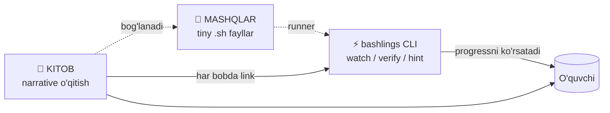

# Kirish so'zi

Salom! Siz hozir o'zbek tilidagi birinchi to'liq **Bash & Linux** o'qitish ekotizimini ochdingiz.

Bu — oddiy darslik emas. **The Rust Book + Rustlings** modeliga asoslangan, uch ustunli o'qitish tizimi.

---

## Uchta ustun



| Ustun           | Texnologiya               | Roli                              |
|-----------------|---------------------------|-----------------------------------|
| 📘 **Kitob**    | VitePress markdown        | "Nima va nima uchun" — nazariya   |
| 🧪 **Mashqlar** | `# I AM NOT DONE` .sh     | "Hozir o'zing bajarib ko'r"       |
| ⚡ **CLI**       | `bashlings` (Rust)        | "Avto-tekshiruv + UX"             |

Aynan shu uchlik **passiv o'qishni** **faol mahoratga** aylantiradi.

---

## Kim uchun mo'ljallangan?

::: tip Siz darslikdan eng katta foyda olasiz, agar:
- **Boshlovchi** bo'lsangiz — Linux yoki Bash bilan endi tanishyapsiz
- **Junior dasturchi** bo'lsangiz — DevOps yo'liga kirayapsiz
- **Backend / SRE** muhandisi bo'lsangiz — terminalda erkin bo'lishni xohlaysiz
- **Tarjima boyligini** sevsangiz — o'zbek tilida texnik kontent kamligini bilasiz
:::

::: warning Bu kitob siz uchun **emas**, agar:
- Faqat passiv o'qishni xohlasangiz va terminal ochmoqchi bo'lmasangiz
- Bash'ning eng past darajadagi POSIX nuances'larini izlasangiz (bu yerda **amaliy** Bash 4+ ga e'tibor qaratilgan)
:::

---

## Qanday o'qish kerak?

### 1. Avval CLI o'rnatilsin

```bash
# Klon qiling
git clone https://github.com/qobulovasror/bashlings
cd bashlings/cli

# Build qiling
cargo install --path .
```

Batafsil → [Setup](/setup)

### 2. Har bobni 3 bosqichda o'qing

1. **Kitobni o'qing** (15-40 daqiqa) — nazariyani tushunib chiqing
2. **`bashlings watch` ni oching** — terminal'da yashil ✓ to'plang
3. **Bo'limning oxiridagi qo'shimcha vazifalarni** terminalda qo'l bilan sinab ko'ring

::: info "I AM NOT DONE" tushunchasi
Har mashq `# I AM NOT DONE` marker bilan boshlanadi. Mashqni tugatdingizmi —
shu qatorni o'chiring. CLI buni progress ko'rsatkichi sifatida ishlatadi.
:::

### 3. Boblar tartibida (yoki o'zingizga moslang)

| Qism | Mavzu | Mashqlar | Tavsiya |
|---|---|---|---|
| **Part 1** | Linux & Bash asoslari | 32 ta | Tartib bilan o'qing |
| **Part 2** | Advanced scripting | 28 ta | Part 1 dan keyin |
| **Part 3** | Real-world (network, ssh, jq, cron, docker, ci) | 41 ta | Mavzuga ko'ra tanlang |

**Jami:** 16 bob + 101 mashq.

---

## Falsafa

> "Bash'ni o'rganishni rust-tipidagi **tezkor + qiziqarli** tajribaga aylantiramiz."

### Nima bizni boshqalardan ajratadi?

- **Avto-tekshiruv** — har mashq stdout/exit code bilan tasdiqlanadi
- **Bosqichli maslahat** — "yechim bering" yo'q; konsept → misol → yechim
- **Offline-friendly** — internetsiz, daemon-siz hammasi ishlaydi
- **O'zbek tilida** — atamalar lug'ati bir xilligini ta'minlaydi (→ [Glossary](/glossary))

### Inspiratsiya

- [The Rust Book](https://doc.rust-lang.org/book/) — strukturasi
- [`rustlings`](https://github.com/rust-lang/rustlings) — `# I AM NOT DONE` g'oyasi
- [`jlevy/the-art-of-command-line`](https://github.com/jlevy/the-art-of-command-line) — eng yaxshi amaliyotlar
- [`denysdovhan/bash-handbook`](https://github.com/denysdovhan/bash-handbook) — sodda til

---

## Qisqacha

1. **Boshlash:** [Setup →](/setup)
2. **O'qish:** [1-bob — Shell, Terminal va Bash nima? →](/part1/01-introduction)
3. **Atamalar:** [Glossary →](/glossary)
4. **Yordam kerakmi?** [GitHub Issues](https://github.com/qobulovasror/bashlings/issues)

---

> Terminal — sehrli emas, **mahorat**. Va har mahorat — mashq bilan keladi.
> Yashil ✓ to'plashga tayyormisiz?

[**→ Birinchi bob**](/part1/01-introduction)
