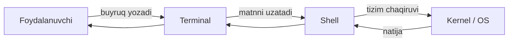

# 1. Shell, Terminal va Bash nima?

> Bu bobda nima o'rganasiz:
> - **Terminal**, **shell** va **bash** — uchta alohida tushuncha o'rtasidagi farq
> - Birinchi terminal sessiyasini ochish va buyruq kiritish
> - Prompt belgisining mazmuni
> - Asosiy buyruqlar: `pwd`, `echo`, `whoami`, `date`
>
> **⏱ Vaqt:** ~15 daqiqa
> **🧪 Mashqlar:** `bashlings watch` — 5 ta interaktiv mashq tayyor ([`exercises/01_intro/`](https://github.com/qobulovasror/bashlings/tree/main/exercises/01_intro))

Linux yoki macOS bilan ishlashni boshlaganingizda eshitadigan birinchi atamalar — **terminal**, **shell** va **bash**. Ko'pchilik ularni bir narsa deb o'ylaydi, lekin aslida bular **uchta alohida tushuncha**dir. Keling, har birini batafsil ko'rib chiqamiz.

## 1.1. Terminal nima?

**Terminal** (yoki "terminal emulator") — bu dasturning grafik oynasi bo'lib, u sizga matn ko'rinishidagi buyruqlarni kiritish va ularning natijasini ko'rish imkonini beradi.

Boshqacha aytganda, terminal — bu **eshik** (oyna), shell esa shu eshikdan kiradigan **ofitsiant**.

Mashhur terminal dasturlari:

| OS         | Terminal dasturlari                                    |
|------------|--------------------------------------------------------|
| macOS      | `Terminal.app`, `iTerm2`, `Warp`, `Alacritty`          |
| Linux      | `GNOME Terminal`, `Konsole`, `xterm`, `kitty`          |
| Windows    | `Windows Terminal`, `WSL`, `Git Bash`                  |

::: info Eslatma
Terminal — bu shunchaki "konteyner". Ichida qaysi shell ishlayotgani esa boshqa masala.
:::

## 1.2. Shell nima?

**Shell** — foydalanuvchi bilan operatsion tizim yadrosi (kernel) o'rtasidagi **tarjimon dastur**. Siz `ls` deb yozasiz, shell uni o'qiydi, kernelga "shu papkadagi fayllar ro'yxatini ber" deb so'rov yuboradi va natijani sizga qaytaradi.



Eng mashhur shell dasturlari:

- **`bash`** — Bourne Again SHell (Linuxda standart)
- **`zsh`** — Z Shell (macOS'da default, ko'p funksional)
- **`fish`** — Friendly Interactive Shell (zamonaviy, auto-suggest bilan)
- **`sh`** — POSIX shell (eng minimal)
- **`dash`**, **`ksh`** — boshqa variantlari

## 1.3. Bash nima?

**Bash** (Bourne Again SHell) — 1989-yilda Brian Fox tomonidan GNU loyihasi uchun yozilgan shell. U eski **`sh`** (Bourne shell)ning kengaytirilgan, kuchaytirilgan versiyasi.

Bash bugungi kunda:

- Aksariyat Linux distributivlarida **default**
- Skript yozish uchun **eng keng tarqalgan**
- POSIX standartiga **mos**
- Millionlab serverlar va CI/CD pipeline'larida **ishlatiladi**

::: tip Qaysi shell sizda ishlayapti?
Hozirgi shell turini bilish uchun:

```bash
echo $SHELL
# /bin/bash  yoki  /bin/zsh
```

Yoki versiyani ko'rish:

```bash
bash --version
# GNU bash, version 5.2.15(1)-release ...
```
:::

## 1.4. Prompt — buyruq qatori belgisi

Terminalni ochsangiz, biror belgi kutib turibdi:

```text
user@hostname:~$
```

Bu — **prompt**. Uning tarkibi:

| Qism         | Ma'nosi                                    |
|--------------|--------------------------------------------|
| `user`       | Foydalanuvchi nomi                         |
| `hostname`   | Kompyuter nomi                             |
| `~`          | Joriy katalog (~ — bu home directory)      |
| `$`          | Oddiy foydalanuvchi (root bo'lsa `#`)      |

::: warning Diqqat
Agar prompt'da `#` ko'rsangiz — siz **root** (superuser) sifatida ishlayapsiz. Har bir buyruq juda ehtiyotkorlik bilan kiritilishi kerak!
:::

## 1.5. Birinchi buyruqlaringiz

Keling, asosiy buyruqlar bilan tanishaylik:

```bash
# Salom dunyo
echo "Salom, Bash!"

# Joriy sana va vaqt
date

# Tizim haqida ma'lumot
uname -a

# Qaysi foydalanuvchisiz?
whoami

# Qaysi papkdasiz?
pwd

# Mavjud buyruq qayerdan ishlayapti?
which ls
```

Natija namunasi:

```text
$ whoami
mac
$ pwd
/Users/mac
$ which ls
/bin/ls
```

## 1.6. `man` — yordamchingiz

Har bir Unix buyrug'i o'zining qo'llanmasiga ega. Uni `man` (manual) buyrug'i orqali ochasiz:

```bash
man ls
man grep
man bash
```

Manual ichida:

- **Yuqoriga / Pastga:** `↑ ↓` yoki `j` `k`
- **Qidirish:** `/qidiriladigan-so'z`, keyin `Enter`
- **Chiqish:** `q`

::: tip Tezroq variant
Ba'zi buyruqlar `--help` flagini qo'llab-quvvatlaydi:

```bash
ls --help
grep --help
```
:::

## 1.7. Tarixiy buyruqlar va auto-complete

Bash sizga ish tezligini oshiruvchi ikkita ulkan imkoniyat beradi:

### History (tarix)

```bash
history          # oxirgi buyruqlar ro'yxati
!!               # oxirgi buyruqni qayta ishga tushiradi
!123             # tarixdagi 123-buyruqni ishga tushiradi
Ctrl + R         # tarixdan qidirish (incremental search)
```

### Tab completion

Buyruq yoki fayl nomini to'liq yozish shart emas — `Tab` tugmasini bosing va Bash o'zi yakunlab beradi.

```bash
cd Doc<Tab>      # → cd Documents/
ls -l README<Tab> # → ls -l README.md
```

## 1.8. Tez-tez uchraydigan xatolar

::: danger Boshlovchilar uchun ogohlantirish

1. **Bo'shliqlarga e'tibor bering.** Bashda `x=5` to'g'ri, `x = 5` esa xato (probel — alohida argument).
2. **Hech qachon `rm -rf /` ni bajarmang.** Bu butun tizimni o'chiradi.
3. **`sudo` ni o'ylab ishlating.** U "men nima qilayotganimni bilaman" demakdir.
4. **Buyruqlar katta-kichik harf farqlaydi.** `ls` va `LS` — bir xil emas.
:::

## 1.9. Mashqlar

::: tip 🧪 Bashlings — interaktiv mashqlar
Bu bobning **5 ta** mashqi `bashlings` CLI orqali avto-tekshiruv bilan:

```bash
bashlings watch              # birinchi pending mashqdan boshlash
bashlings run intro1         # bitta mashqni tekshirish
bashlings hint intro1        # bosqichli maslahat
```

Manba: [`exercises/01_intro/`](https://github.com/qobulovasror/bashlings/tree/main/exercises/01_intro)
:::

Quyidagi qo'shimcha vazifalarni terminalda qo'l bilan bajaring:

1. O'z home katalogingizning to'liq yo'lini chiqaring.
2. Qaysi shell ishlatayotganingizni aniqlang.
3. `bash` versiyasini ko'ring.
4. `date` buyrug'ining `man` sahifasini oching va `--iso-8601` flagini topib qo'llang.
5. Tarixdagi oxirgi 5 ta buyruqni chiqaring (`history | tail -5`).

## 1.10. Xulosa

| Atama       | Mohiyat                                              |
|-------------|------------------------------------------------------|
| **Terminal**| Matn interfeysiga ega oyna (dastur)                  |
| **Shell**   | Buyruqlarni tushunadigan tarjimon (bash, zsh, fish)  |
| **Bash**    | Eng mashhur shell dasturi                            |
| **Prompt**  | Buyruq kiritish chizig'i (`$` yoki `#`)              |
| **`man`**   | Buyruq qo'llanmasi                                   |

Keyingi bobda biz **fayl tizimi bo'ylab harakatlanish**ni o'rganamiz: `cd`, `ls`, `pwd`, `mkdir`, `cp`, `mv`, `rm`.

> **Keyingi sahifa:** [2. Fayl tizimi bo'ylab navigatsiya →](./02-navigation)
