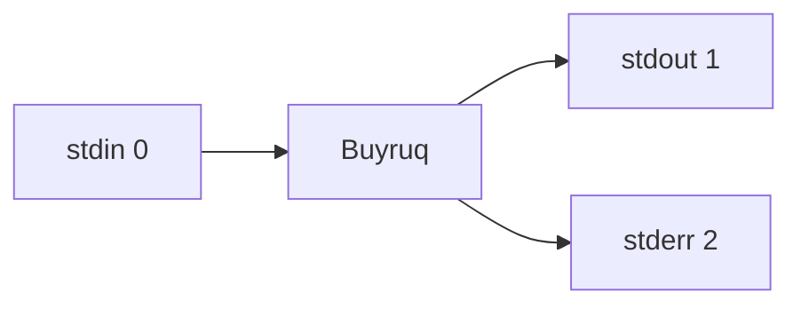

# 3. I/O Redirection va Pipelines

Unix falsafasining eng kuchli g'oyasi:

> "Bitta vazifani yaxshi bajaradigan kichik dasturlarni yozing va ularni bir-biri bilan **bog'lab**, murakkab vazifalarni hal qiling."

Aynan **redirection** va **pipes** shu g'oyani amalga oshiradi.

## 3.1. Uchta standart oqim

Har bir Unix jarayonida **3 ta standart oqim** mavjud:

| Oqim       | Raqam | Ma'nosi                                |
|------------|-------|----------------------------------------|
| `stdin`    | `0`   | Kirish (klaviaturadan yoki fayldan)    |
| `stdout`   | `1`   | Chiqish (ekranga normal natija)        |
| `stderr`   | `2`   | Xatoliklar oqimi                       |



`echo "Salom"` buyrug'i `Salom` matnini **stdout**'ga yozadi. `ls /yoq` esa xatolikni **stderr**'ga yozadi.

## 3.2. `>` — chiqishni faylga yo'naltirish

`>` operatori `stdout`ni faylga yo'naltiradi. **Fayl mavjud bo'lsa, ustiga yoziladi (overwrite).**

```bash
echo "Salom dunyo" > hello.txt
cat hello.txt
# Salom dunyo

ls > files.txt
# joriy katalog tarkibi files.txt ichida
```

::: danger Diqqat: overwrite!
`>` har safar **eski mazmunni o'chiradi**. Agar faylda muhim ma'lumot bo'lsa, ehtiyot bo'ling.
:::

## 3.3. `>>` — faylga qo'shib yozish

`>>` operatori faylga **append** qiladi (oxiriga qo'shib boradi):

```bash
echo "Birinchi qator" > log.txt
echo "Ikkinchi qator" >> log.txt
echo "Uchinchi qator" >> log.txt

cat log.txt
# Birinchi qator
# Ikkinchi qator
# Uchinchi qator
```

::: tip Log fayllar uchun ideal
Skriptlar log yozayotganda har doim `>>` ishlatiladi:

```bash
echo "[$(date)] Backup boshlandi" >> /var/log/backup.log
```
:::

## 3.4. `<` — fayldan o'qish (stdin redirect)

`<` operatori faylni `stdin` sifatida buyruqqa beradi:

```bash
# Klassik usul
cat < file.txt

# Misol: wc bilan qatorlar sonini sanash
wc -l < /etc/passwd

# Skript ichida foydalanuvchi inputini fayldan o'qish
while read -r line; do
    echo "Qator: $line"
done < input.txt
```

::: info Farqi
- `cat file.txt` — `cat`ga argument sifatida fayl beriladi
- `cat < file.txt` — `cat`ning stdin'iga fayl yo'naltiriladi

Natijasi bir xil bo'lishi mumkin, lekin **mexanizmi farqli**.
:::

## 3.5. `2>` — xatoliklarni yo'naltirish

`stderr` boshqacha — uni alohida yo'naltirish kerak:

```bash
# Faqat xatolarni faylga
ls /yoq-fayl 2> errors.log

# Stdout'ni faylga, stderr'ni ekranga
ls /etc /yoq-fayl > out.txt
# stdout fayl ichida, stderr ekranda

# Stderr'ni "yo'q" qilish
ls /yoq-fayl 2>/dev/null
```

::: tip `/dev/null` — qora tuynuk
`/dev/null` — bu maxsus fayl. Unga yozilgan har qanday narsa **yo'qoladi**. Keraksiz outputni "yutib yuborish" uchun ishlatiladi.
:::

## 3.6. `2>&1` — stderr'ni stdout'ga qo'shish

Eng ko'p chalkashtiradigan, lekin eng kuchli sintaksis:

```bash
# Stdout VA stderr ni bitta faylga
command > output.log 2>&1

# Bash 4+ uchun qisqaroq variant
command &> output.log

# Stdout va stderr ni butunlay yo'q qilish
command > /dev/null 2>&1
command &>/dev/null
```

::: warning Tartib muhim!
`> file 2>&1` — to'g'ri (avval stdout faylga, keyin stderr stdout'ga)
`2>&1 > file` — XATO (stderr ekranga, faqat stdout faylga ketadi)
:::

## 3.7. Pipe `|` — buyruqlarni zanjirlash

**Pipe** (`|`) — bitta buyruqning `stdout`ini ikkinchi buyruqning `stdin`iga ulaydi.


Klassik misol:

```bash
ls -l | grep ".md"
# faqat .md bilan tugaydigan qatorlar
```

```bash
cat access.log | grep "404" | wc -l
# access.log'da nechta 404 xatolik bor
```

```bash
ps aux | grep python | grep -v grep
# python jarayonlari (grep o'zini ko'rsatmaydi)
```

```bash
history | sort | uniq -c | sort -rn | head -10
# eng ko'p ishlatilgan 10 ta buyruq
```

::: tip Unix falsafasi
Bitta vazifani bajaradigan **kichik** buyruqlarni `|` orqali ulab, **murakkab** muammolarni hal qilamiz.
:::

## 3.8. `tee` — ikkala tomonga yozish

`tee` `stdin`dan o'qiydi va `stdout`ga **ham**, faylga **ham** yozadi. Nomi suvni "T-shaped" trubadan o'tkazishga ishora qiladi.

```bash
# Natijani ham ekranga, ham faylga
ls -l | tee files.txt

# Faylga append qilib
echo "yangi qator" | tee -a log.txt

# Sudo bilan birga ishlatish
echo "127.0.0.1 myapp.local" | sudo tee -a /etc/hosts
```

::: tip `sudo` va `>` muammosi
Bu **ishlamaydi**:

```bash
sudo echo "x" > /etc/protected.conf  # ❌ Permission denied
```

Sababi: `>` shell tomonidan, sudosiz bajariladi. To'g'ri yo'l:

```bash
echo "x" | sudo tee -a /etc/protected.conf  # ✅
```
:::

## 3.9. Here Document (`<<`) — ko'p qatorli input

`<<` orqali fayl yaratmasdan, terminaldagi matnni stdin sifatida berish mumkin:

```bash
cat << EOF
Salom, dunyo!
Bu bir nechta qator.
$(date) — joriy vaqt
EOF
```

`EOF` (yoki istalgan so'z) — chegara belgisi. Uning ichidagi `$o'zgaruvchi` va `$(buyruq)` ifodalari bajariladi.

Agar **bajarilmasin** desangiz, EOF'ni qo'shtirnoq ichiga oling:

```bash
cat << 'EOF'
$HOME shu holicha qoladi
EOF
```

## 3.10. Here String (`<<<`) — bir qatorli input

```bash
grep "uzbek" <<< "men o'zbekman"
# men o'zbekman

bc <<< "5 + 7"
# 12
```

## 3.11. Process substitution `<(...)` va `>(...)`

Buyruqning chiqishini xuddi **fayl**dek ishlatish mumkin:

```bash
# Ikkita buyruq natijasini taqqoslash
diff <(ls dir1) <(ls dir2)

# Ikki tartiblangan faylni birlashtirish
sort -m <(sort a.txt) <(sort b.txt)
```

::: info Klassik fayl o'rniga
Bu xususiyat vaqtinchalik fayllarni yaratmasdan, dasturlarni "go'yo fayl" kabi ulashga yordam beradi.
:::

## 3.12. Real misollar

### Misol 1: Disk bandligini topish

```bash
du -sh * 2>/dev/null | sort -hr | head -5
# joriy katalogdagi eng katta 5 ta element
```

### Misol 2: Log fayllar tahlili

```bash
grep "ERROR" /var/log/app.log \
  | awk '{print $1}' \
  | sort \
  | uniq -c \
  | sort -rn \
  > error_report.txt
```

### Misol 3: Tarmoq ulanishlarini sanash

```bash
netstat -an | grep ESTABLISHED | wc -l
```

### Misol 4: Process'larni tartiblash

```bash
ps aux --sort=-%mem | head -10
# eng ko'p RAM yegan 10 ta jarayon
```

## 3.13. Tez-tez uchraydigan xatolar

::: danger Eslatib o'tamiz

1. **`>` `>>` farqini chalkashtirmang.**
   `>` — qayta yozadi, `>>` — qo'shib boradi.

2. **`2>&1` tartibi.**
   `command > out 2>&1` — to'g'ri.
   `command 2>&1 > out` — xato.

3. **Pipe'da xatolik yashirinishi.**
   `cat a.txt | grep foo`'da `cat`'ning xatosi `stdout`ga emas, `stderr`ga ketadi. Pipe'ni siljitmaydi.

4. **`sudo` va `>` birlashtirish.**
   `sudo tee` ishlatishni unutmang.
:::

## 3.14. Mashqlar

1. `ls -la` natijasini `directory.txt`ga yozing va ekranda ham ko'rsating (`tee` bilan).
2. `/etc/passwd` faylida nechta foydalanuvchi borligini bitta pipeline bilan toping.
3. `ps aux` natijasidagi eng ko'p CPU yegan 5 ta jarayonni topadigan pipeline yozing.
4. `dmesg` natijasini stderr bilan birga `system.log`ga yozing.
5. `<<< "5+5"` orqali `bc` calculator'iga oddiy hisob bering.

## 3.15. Xulosa

| Operator   | Ma'nosi                                       |
|------------|-----------------------------------------------|
| `>`        | stdout'ni faylga (overwrite)                  |
| `>>`       | stdout'ni faylga (append)                     |
| `<`        | Fayldan stdin                                 |
| `2>`       | stderr'ni faylga                              |
| `2>&1`     | stderr → stdout                               |
| `&>`       | stdout + stderr birga                         |
| `\|`       | Pipe (buyruqlar zanjiri)                      |
| `tee`      | Ekranga **va** faylga                         |
| `<<`       | Here document                                 |
| `<<<`      | Here string                                   |

Endi siz buyruqlarni xohlagancha bog'lay olasiz. Keyingi bobda **matnlar bilan ishlash** — `cat`, `head`, `tail`, `grep`, `wc` — buyruqlarini chuqurroq o'rganamiz.

> **Keyingi sahifa:** [4. Matnlar bilan ishlash →](./04-text-processing)
